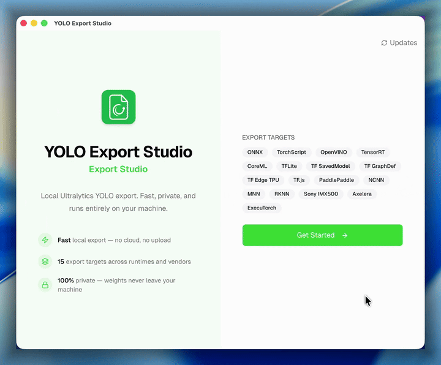

<div align="center">

# YOLO Export Studio

Desktop studio for exporting Ultralytics YOLO `.pt` models into deployment-ready formats.

[](#installation)
[](#installation)
[](https://v2.tauri.app)
[](#build-from-source)
[](#build-from-source)

</div>

> [!IMPORTANT]
> **This project is currently under active development.** Some features may be incomplete or subject to change. Bug reports and feature requests are appreciated!

<br>

<div align="center">
  
</div>

<br>

> Select your Ultralytics YOLO `.pt` model, pick an export target, and generate deployment-ready output locally - everything runs on your machine, nothing leaves your environment.

---

## Table of Contents

- [Features](#features)
- [Supported Formats](#supported-formats)
- [Target Caveats](#target-caveats)
- [Installation](#installation)
- [Build From Source](#build-from-source)
- [Contributing](#contributing)
- [Security](#security)
- [License](#license)

---

[**YOLO Export Studio**](https://github.com/amanharshx/yolo-export-studio) is a desktop app that exports [Ultralytics](https://www.ultralytics.com/) YOLO `.pt` weights into deployment-ready formats like ONNX, TensorRT, CoreML, TFLite, and more. Select your model, pick a target, and generate the export locally - model files stay on your machine.

## Features

- **Local-first** - exports run on your machine; model files do not leave your environment
- **Managed runtime** - app creates and uses `~/.yolo-export-studio/.venv` for Python tooling by default
- **Optional Python override** - power users can point the app at a different interpreter
- **Automatic route installs** - route-specific Python dependencies install when needed for most export paths
- **Multiple export targets** - ONNX, TensorRT, CoreML, OpenVINO, TFLite, Paddle, NCNN, RKNN, and more
- **Safer process execution** - export commands run through Tauri/Rust with argv-based subprocess handling

---

## Supported Formats

YOLO Export Studio is **not** universal all-to-all model converter.

```text
source format -> supported route -> target format
```

Current source support is intentionally narrow:

- Ultralytics-compatible `.pt` weights only
- Generic PyTorch checkpoints not supported
- Reverse conversion not supported

Current source format:

| Format | Status | Notes |
| --- | :---: | --- |
| `.pt` | ✅ | Ultralytics-compatible weights only. |

Current target formats:

| Format | Status | Notes |
| --- | :---: | --- |
| `.pt -> onnx` | ✅ | Most portable intermediate. |
| `.pt -> torchscript` | ✅ | Traced TorchScript module. |
| `.pt -> openvino` | ✅ | Optimised for Intel CPUs, iGPUs, and VPUs. |
| `.pt -> engine` | ✅ | TensorRT. NVIDIA GPU and supported stack required. |
| `.pt -> coreml` | ✅ | macOS-only. |
| `.pt -> saved_model` | ✅ | TensorFlow SavedModel output. |
| `.pt -> pb` | ✅ | TensorFlow GraphDef output. |
| `.pt -> tflite` | ✅ | One-way runtime artifact. |
| `.pt -> edgetpu` | ✅ | Linux `x86_64` and `edgetpu_compiler` required. |
| `.pt -> tfjs` | ✅ | Web deployment output. |
| `.pt -> paddle` | ✅ | PaddlePaddle export path. |
| `.pt -> ncnn` | ✅ | Mobile-friendly runtime output. |
| `.pt -> mnn` | ✅ | One-way runtime artifact. |
| `.pt -> rknn` | ✅ | Linux-only. Target chip required. |
| `.pt -> imx` | ✅ | Linux-only. Java `>= 17` required. |
| `.pt -> axelera` | ✅ | Linux-only. |
| `.pt -> executorch` | ✅ | Edge runtime output. |

---

## Target Caveats

Some targets are one-way deployment artifacts or platform-locked:

- `engine` requires NVIDIA GPU and supported TensorRT stack. No macOS support.
- `coreml` export is macOS-only.
- `edgetpu` export requires Linux `x86_64` and `edgetpu_compiler`.
- `rknn` export is Linux-only and requires target chip selection.
- `imx` export is Linux-only and requires Java `>= 17`.
- `axelera` export is Linux-only.
- `tflite`, `engine`, `mnn`, `rknn`, `imx`, `axelera`, `edgetpu`, and some `coreml` outputs should be treated as one-way deployment outputs.

---

## Installation

### Quick Install

**macOS (Homebrew):**

```bash
brew install --cask amanharshx/tap/yolo-export-studio
```

**Linux (Homebrew):**

```bash
brew install amanharshx/tap/yolo-export-studio
```

**Windows / macOS / Linux (GitHub Releases):**

Download the latest desktop build from [GitHub Releases](https://github.com/amanharshx/yolo-export-studio/releases).

**Linux package note:**

Current Linux release assets include Homebrew tarball, `.AppImage`, `.deb`, and `.rpm` packages.

### Troubleshooting

> **Note:** The app is not code-signed yet, so macOS and Windows may show security warnings.

<details>
<summary><b>macOS</b> - "App is damaged and can't be opened"</summary>

Run this command in Terminal after installing:

```bash
xattr -cr "/Applications/YOLO Export Studio.app"
```

Then open the app again.

</details>

<details>
<summary><b>Windows</b> - "Windows protected your PC" (SmartScreen)</summary>

1. Click **More info**
2. Click **Run anyway**

Or: Right-click the `.exe` -> **Properties** -> Check **Unblock** -> **Apply**

</details>

### First Launch Runtime Setup

Expected flow:

- install app
- let YOLO Export Studio prepare runtime on first launch
- pick export route
- install route dependencies only when needed

YOLO Export Studio now defaults to managed runtime in:

```text
~/.yolo-export-studio/.venv
```

YOLO Export Studio creates this environment automatically and installs `ultralytics` there.

Current bootstrap limitation:

- first-time runtime creation still depends on working `python`/`python3` already available on host machine
- bundled Python is not implemented yet

---

## Build From Source

**Prerequisites:** [Rust](https://rustup.rs/), [Bun](https://bun.sh/), [Tauri v2 prerequisites](https://v2.tauri.app/start/prerequisites/)

```bash
git clone https://github.com/amanharshx/yolo-export-studio.git
cd yolo-export-studio
bun install
bun run tauri dev      # development
bun run tauri build    # local production build
```

---

## Contributing

Contributions are welcome. Whether it's a bug fix, new format, or documentation improvement - every bit helps. Please read the [Contributing Guide](CONTRIBUTING.md) before opening a pull request.

---

## Security

If you discover a security issue, please do not open a public issue. Use GitHub private vulnerability reporting as described in [SECURITY.md](SECURITY.md).

---

## License

This project is licensed under the [MIT License](LICENSE).
