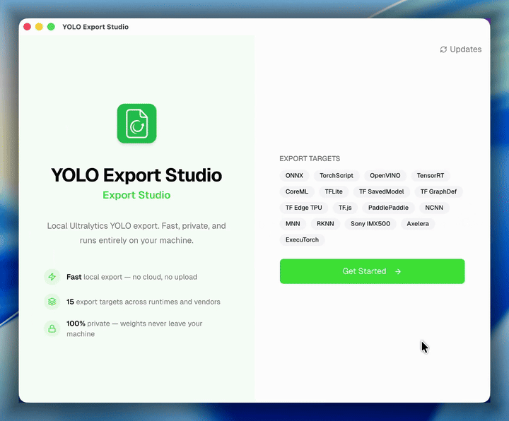

<div align="center">

# Vision Export Studio

Desktop studio for exporting Ultralytics YOLO `.pt` and Roboflow RF-DETR `.pth` models into deployment-ready formats.

[](#installation)
[](#installation)
[](https://v2.tauri.app)
[](#build-from-source)
[](#build-from-source)

[](https://github.com/amanharshx/vision-export-studio/actions/workflows/ci.yml)
[](https://github.com/amanharshx/vision-export-studio/releases)

<br>



</div>
<br>

> Select your Ultralytics YOLO `.pt` or Roboflow RF-DETR `.pth` model, pick an export target, and generate deployment-ready output locally - everything runs on your machine, nothing leaves your environment.

---

## Table of Contents

- [What it is](#what-it-is)
- [Features](#features)
- [Installation](#installation)
- [First Run](#first-run)
- [Troubleshooting](#troubleshooting)
- [Export Reference](#export-reference)
- [Build From Source](#build-from-source)
- [Analytics](#analytics)
- [Privacy](#privacy)
- [Contributing](#contributing)
- [Security](#security)
- [License](#license)

---

## What it is

[**Vision Export Studio**](https://github.com/amanharshx/vision-export-studio) is a local-first desktop app that exports computer-vision model weights into deployment-ready formats. Model files stay on your machine.

Two providers, chosen by file extension (mismatches are rejected):

- **Ultralytics YOLO (`.pt`)** - ONNX, TorchScript, OpenVINO, TensorRT, CoreML, LiteRT, TF SavedModel, TF GraphDef, Edge TPU, PaddlePaddle, NCNN, MNN, RKNN, Sony IMX500, Axelera, and ExecuTorch.
- **Roboflow RF-DETR (`.pth`)** - ONNX (recommended), TensorRT, experimental CoreML, experimental TFLite, and experimental ExecuTorch (XNNPACK).

Per-route precision options, platform requirements, calibration notes, and runtime paths live in the [Export Reference](docs/export-reference.md).

## Features

- **Local-first** - exports run on your machine; model files do not leave your environment
- **Two model families** - Ultralytics YOLO (`.pt`) and Roboflow RF-DETR (`.pth`), selected by file extension
- **Per-route setup** - each export route is set up explicitly before export; setup never starts an export
- **Dependency status checks** - each route reports missing Python packages or system binaries before you export, with install hints
- **Optional Python override** - power users can choose a bootstrap interpreter used only to create the managed environment
- **Optional output directory** - choose where exported artifacts are written, or use the default next to the source model
- **Configurable export options** - tune target-specific settings such as image size, batch size, precision, dynamic axes, ONNX opset, TensorRT workspace, and RKNN target chip
- **RF-DETR checkpoint inspection** - after trusted-checkpoint confirmation, auto-detects model family (detection vs segmentation), size, and recommended native image size from the `.pth` checkpoint
- **Safer process execution** - export commands run through Tauri/Rust with argv-based subprocess handling

---

## Installation

### Quick Install

**macOS (Homebrew):**

```bash
brew install --cask amanharshx/tap/vision-export-studio
```

**Linux (Homebrew):**

```bash
brew install amanharshx/tap/vision-export-studio
```

**Windows / macOS / Linux (GitHub Releases):**

Download the latest desktop build from [GitHub Releases](https://github.com/amanharshx/vision-export-studio/releases).

**Linux package note:**

Current Linux release assets include Homebrew tarball, `.AppImage`, `.deb`, and `.rpm` packages.

### In-App Updates

Released builds can check for updates from `Updates` inside app.

Expected flow:

- click `Updates`
- if no update exists, app shows `Up to date`
- if update exists, app offers `Update to <version>`
- after install, click `Restart to update`

Updater metadata is served from GitHub Releases.

### Unsigned app notes

> **Note:** The app is not code-signed yet, so macOS and Windows may show security warnings.

<details>
<summary><b>macOS</b> - "App is damaged and can't be opened"</summary>

Run this command in Terminal after installing:

```bash
xattr -cr "/Applications/Vision Export Studio.app"
```

Then open the app again.

</details>

<details>
<summary><b>Windows</b> - "Windows protected your PC" (SmartScreen)</summary>

1. Click **More info**
2. Click **Run anyway**

Or: Right-click the `.exe` -> **Properties** -> Check **Unblock** -> **Apply**

</details>

---

## First Run

Host Python 3.10–3.13 is required (prefers 3.12). There is no bundled Python: install Python 3 first, then restart the app.

Expected flow:

- open the app (no provider environment is needed to start)
- drop a `.pt` or `.pth` model and choose its provider (extension mismatches are rejected)
- press **Set up** for the selected export route only
- run the export after that route reports ready

Setup never starts an export.

Runtime locations:

- Ultralytics routes use `~/.vision-export-studio/.venv`, created on Set up for an Ultralytics route.
- RF-DETR routes use `~/.vision-export-studio/envs/<stack>/.venv`, created on Set up for the selected route:
  - `rfdetr-default` covers ONNX and ExecuTorch
  - `rfdetr-tensorrt` covers TensorRT
  - `rfdetr-coreml` covers CoreML
  - `rfdetr-tflite` covers TFLite and requires Python 3.12 (`>=3.12, <3.13`)

A chosen Python override is bootstrap only: the app uses it to create the managed environment. Packages are never installed into it and exports never run through it.

After `Remove` / `Reset runtime`, the loaded model stays in the workspace; the affected routes need Set up again before export.

Ultralytics exports require Ultralytics 8.4.80 or newer; LiteRT requires 8.4.83 or newer. The app reports incompatible runtime versions before export and offers an in-app Ultralytics update when possible.

---

## Troubleshooting

- **Unsigned app warnings:** macOS may report the app is damaged and Windows SmartScreen may block it. See the [unsigned app notes](#unsigned-app-notes) above.
- **No compatible Python:** install Python 3.10–3.13 (3.12 preferred), then restart Vision Export Studio. The RF-DETR TFLite stack needs Python 3.12.
- **Route not ready:** press **Set up** for that route and wait until it reports ready. Setup installs only that route's environment; other routes still need their own Set up.

---

## Export Reference

Full route list, platform requirements, precision modes and defaults, calibration notes, RF-DETR experimental caveats, and runtime paths: [docs/export-reference.md](docs/export-reference.md).

---

## Build From Source

**Prerequisites:** [Rust](https://rustup.rs/), [Bun](https://bun.sh/), [Tauri v2 prerequisites](https://v2.tauri.app/start/prerequisites/)

```bash
git clone https://github.com/amanharshx/vision-export-studio.git
cd vision-export-studio
bun install
bun run tauri dev      # development
bun run tauri build    # local production build
```

---

## Analytics

Vision Export Studio uses PostHog for install-scoped pseudonymous usage analytics. The app stores a persistent install identifier locally so launches from the same install can be measured across sessions.

Current analytics covers:

- app launches
- environment setup results (`environment_setup_completed` with provider, environment key, route ID, success or failure, and setup duration)
- export started, completed, failed, and cancelled
- app and device metadata such as app version, OS, architecture, install channel, and route/event metadata

Collected analytics excludes:

- model files
- model paths or filenames
- checkpoint metadata
- dataset contents
- file contents
- export logs
- package logs
- local file paths
- Python paths or output paths
- raw error text
- personal identity such as email address or username

More detail lives in [PRIVACY.md](PRIVACY.md).

---

## Privacy

Privacy summary: exports run locally, model files stay on your machine, and install-scoped pseudonymous analytics is limited to product usage and app/device metadata. See [PRIVACY.md](PRIVACY.md) for details.

---

## Contributing

Contributions are welcome. Whether it's a bug fix, new format, or documentation improvement - every bit helps. Please read the [Contributing Guide](CONTRIBUTING.md) before opening a pull request.

---

## Security

If you discover a security issue, please do not open a public issue. Use GitHub private vulnerability reporting as described in [SECURITY.md](SECURITY.md).

---

## License

This project is licensed under the [MIT License](LICENSE).
